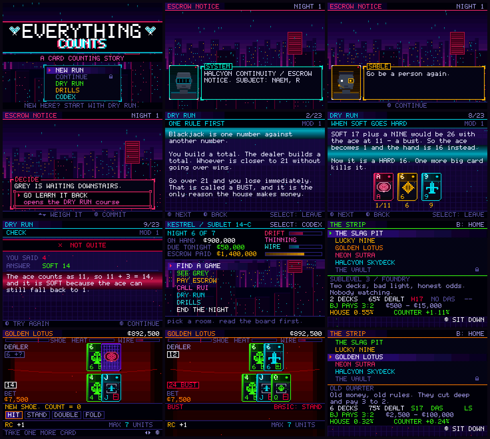

<div align="center">

# EVERYTHING COUNTS

### *Nobody counts any more. That's the point.*

**A transhumanist cyberpunk blackjack game for the Game Boy Advance**
where the core mechanic is learning to count cards —
and the difficulty setting is a morality system.

`128 KiB ROM` · `SRAM save` · `written from scratch in C` · `no engine, no libgba, no devkitPro`

[**Download the ROM →**](../../releases/latest)



</div>

---

```
KESTREL CITY MUNICIPAL NET
NEURAL LACE .............. ABSENT
CO-PROCESSOR ............. NONE
TELEMETRY SIGNATURE ...... CLEAN
ARITHMETIC ............... ORGANIC

YOU ARE UNASSISTED.
```

## The situation

The Verge came down and took your sister's body with it. **HALCYON Continuity**
caught her mind on the way out and put it in escrow:

> **2,000,000 credits over seven nights, or the asset will be resolved into components.**

Somebody wrote that sentence. Somebody signed off on the wording.

Your neural lace burned out in the same collapse. In a city where every pit
scans for co-processor chatter before you have finished sitting down, that
makes you the only person on the strip who can count a shoe **without
broadcasting that you are counting a shoe.**

Seven nights. Seven instalments. One deck at the end.

---

## The trade the whole game is built on

Every assist you could want is for sale from a ripperdoc on sublevel two.
A strategy overlay. A co-processor that holds the running count for you.
An oracle that computes the true count and tells you what to bet.

Each one costs money, adds **WIRE** — telemetry the pit's scanners hunt for —
and adds **DRIFT**: how much of the counting is no longer being done by *you*.

**The game's difficulty setting is its morality system.** Switching the mechanic
off and letting the machine do the work is always available, always effective,
and it permanently changes who walks out at the end. Rui can hear the latency
in your voice over the escrow line. She will not mention it.

There are five endings. Only one of them has you in it.

| Night | What is asked of you |
|:--:|---|
| 2 | A dealer is short-shuffling to pay for her kid's rented lungs. There is a bounty on floor irregularities. |
| 3 | The ripperdoc has chrome that is still warm. The donor is alive, on sublevel two, with a payment plan. |
| 4 | Your fixer needs you to lose 350,000 on camera, badly enough that it reads as human. |
| 5 | A whale asks you to take everything he has, and tells you exactly what it will cost his wife. |
| 6 | HALCYON offers to image you. Rui walks tomorrow. The instance is not you — that distinction is legally settled. |
| 7 | One deck. Dealt to the felt. No cameras, because no witnesses. |

---

## It teaches blackjack from absolutely nothing

No prior card knowledge is assumed anywhere in this game.

### DRY RUN — Grey's training construct

Three modules, 46 interactive pages. Prose, live card art, animated
demonstrations, and multiple-choice checks that explain the answer whether you
got it right or not.

| | |
|---|---|
| **MOD 1 — THE GAME** | what a card is worth · the ace as two numbers · soft vs hard · the deal, the up card, the hole card · hit, stand, double, split, surrender · how the dealer plays · payouts and why 6:5 is robbery · why insurance is a trap |
| **MOD 2 — BASIC STRATEGY** | why a correct answer exists at all · the dealer's weak cards · stiff hands · soft totals · pairs · a browsable chart generated live from the same engine that grades you |
| **MOD 3 — THE COUNT** | why counting works · Hi-Lo tags · running count · true count · the bet ramp · index plays · and why bet *spread*, not arithmetic, is what gets you caught |

### THE RANGE — five timed drills

Tag Drill · Speed Count · True Count · Basic Strategy · Index Plays.
Best scores kept.

### CODEX — always open, always free

Rules · glossary · the strategy chart · counting reference · the Illustrious 18 ·
every room's rules and measured edge · every implant's real cost.

> *The house has no rule against knowing things.*

At the table, **START** opens a plain-language rules book mid-hand, and every
decision is graded afterwards against basic strategy — whether or not you own
the chrome that would have told you in advance.

---

## Counting is the mechanic, not a minigame

- **PULSE CHECKS.** At random, and always at the end of a shoe, the felt stops
  and demands the running count on a timer. Hold it and your **bet ceiling
  rises**. Drop it and the pit clamps your limit. Counting correctly is
  literally the thing that lets you bet enough to win.
- **The bet ramp is graded.** Bet the minimum on a rich shoe and you are told
  you left the edge on the table. Bet big on a dead shoe and **HEAT** spikes,
  because that is exactly how real counters get caught.
- **Game selection is a skill, and the board tells you.** Every room lists
  decks, penetration, S17/H17, DAS, surrender, blackjack payout, the measured
  house edge, **and the measured counter's edge.** One room pays 6:5 and cannot
  be beaten no matter how well you count. The board says so. Reading it is on you.
- **Heat, wire and scans.** Spread too hard and you are backed off for the
  night. Wear too much chrome and the scanner finds it.

---

## The cards

Re-skinned for the Kestrel City tables: **SPIKE** · **PULSE** · **SHARD** ·
**WIRE**. Dark polycarbonate faces with etched circuit traces and a
holographic edge strip, chromed servo brackets clamped around the face cards,
the HALCYON eye as the ace, and a circuit-lattice back.

Everything on screen is drawn in software into a paletted framebuffer.
No tiles, no sprites, no imported art. The cards, the rain, the skyline, the
faces and the neon are all code.

---

## The maths is measured, not asserted

`make test` builds the same `blackjack.c` / `cards.c` / `game.c` that ship in the
ROM against host shims and runs **402 checks**:

- card values, soft/hard evaluation, blackjack vs. a 21 built from three cards,
  21 after a split
- Hi-Lo tags, and that a balanced deck counts to exactly zero
- true-count arithmetic
- **the entire basic-strategy chart**, cell by cell, against a reference for
  6 decks / S17 / DAS / late surrender — 350 cells
- the index plays, at and either side of every threshold
- **3,000,000 hands per room** of perfect basic strategy, confirming the house
  edge the game prints is the one it actually charges
- **decision EV probes** (dealer already peeked) that settle borderline
  surrender calls by measurement rather than memory — this caught a wrong cell
  in the chart during development
- **4,000,000 hands per room** of Hi-Lo with a 1–12 spread

```
THE SLAG PIT       house 0.55%   counter +1.11%   two decks, bad light, honest odds
LUCKY NINE         house 2.17%   counter -2.04%   6:5 — this room is a tax
GOLDEN LOTUS       house 0.32%   counter +0.24%   old money, old rules
NEON SUTRA         house 0.53%   counter -0.14%   eight decks, H17 — still a loser
HALCYON SKYDECK    house 0.29%   counter +0.72%   the best game in the city
THE VAULT          house -0.07%  counter +8.75%   one deck, cut to the felt
```

Those are the numbers the game prints on its own venue board.

---

## Controls

| | |
|---|---|
| **D-pad** | navigate · size bets · dial the count |
| **A** | confirm / deal / act |
| **B** | back / leave the table |
| **START** | rules book (at the table) · skip text |
| **SELECT** | coach overlay (table) · codex (hub) · leave a lesson |
| **L / R** | ±5 when dialling · chart tabs · tag answers in drills |

Default mGBA keyboard mapping: `X`=A, `Z`=B, `A`=L, `S`=R, `Enter`=Start,
`Backspace`=Select, arrows = D-pad.

---

## Build

Needs a bare-metal `arm-none-eabi` GCC and Python 3. **devkitPro is not required.**

```bash
make            # -> dist/everything-counts.gba
make test       # host-side verification of the rules engine
make debug      # late-run build used only by the test harness
make clean
```

The toolchain path is at the top of the `Makefile` (`TOOLCHAIN ?= ...`).
On Arch: `pacman -S arm-none-eabi-gcc arm-none-eabi-binutils arm-none-eabi-newlib`.

```bash
mgba-qt dist/everything-counts.gba
```

> The cartridge header's Nintendo logo field is deliberately left zeroed — that
> data is Nintendo's trademarked boot logo and is not redistributed here. Every
> emulator boots the ROM as-is. For real hardware, splice the logo in with any
> standard `gbafix`-style utility.

---

## Layout

```
src/
  crt0.s          cartridge header, ARM runtime, IRQ dispatcher
  gba.ld          linker script (ROM / IWRAM / EWRAM)
  video.c         Mode 4 page-flipped software renderer
  ui.c            backdrops, panels, meters, procedural portraits, dialogue
  cards.c         the deck, and the card art
  blackjack.c     rules engine — no pixels in this file
  game.c          venues, chrome, run state, counting, strategy tables
  audio.c         PSG synth + pattern sequencer (5 tracks, 20 effects)
  teach*.c        the DRY RUN course and its player
  sc_*.c          scenes: table, story, hub, venues, clinic, drills, codex
  story_data.c    seven nights of it
tools/
  mkfont.py       6x8 terminal face + cyberpunk UI glyphs
  mkart.py        256-colour palette, suit pips, sigils
  gbafix.py       header complement + ROM padding
test/
  host/           rules verification (runs on the host, not the GBA)
  drive.py        emulator-driven screenshot harness
  soak.py         random-input soak test
```

---

## Status: alpha

Playable end to end and verified by simulation, but this is an **alpha**.
The full seven-night arc has been driven by the automated harness rather than
finished by a human, so balance across nights 5–7 is unproven. Bug reports,
especially "the game said my play was wrong and it wasn't", are very welcome —
`make test` exists precisely so those can be settled by measurement.

---

## Licence

Copyleft, as appropriate to each kind of work.

- **Code** — [GNU AGPL v3.0 or later](LICENSE). The ROM you build from this
  source is free software. Distribute a modified version — or run one where
  other people can reach it over a network — and your users get the same
  freedoms you got, source included.
- **Documentation, prose, story text and art assets** —
  [CC BY-SA 4.0](LICENSE-DOCS).

Copyright © 2026 Godless-1. This program comes with **absolutely no warranty**.

*Blackjack strategy and the Hi-Lo counting system are mathematical facts and
belong to nobody. The specific expression of them here is copylefted so it
stays that way.*
